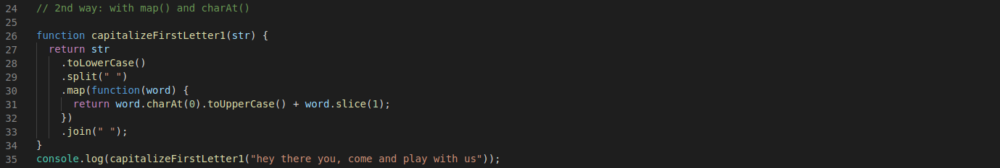

# 2nd solution on the "capitalizeFirstLetter" exercise

Created a function named "capitalizeFirstLetter" in which I used firstly the .toLowerCase().split(" ") methods to convert the string into an array with lower case characters, then used a map() method to iterate over all the elements inside the array. Inside the loop I converted the first character of each indivual index of the array with usinng charAt().toUppercase() and concatenated the rest of each indexes back to their first character with slice(). At the end I used the join(" ") method to return a string back.
