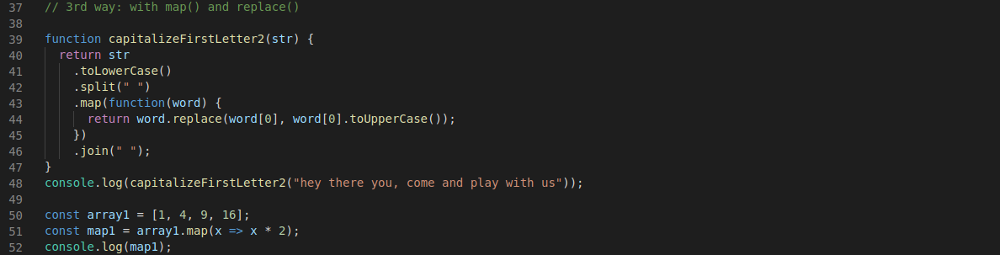

# 3rd solution on the "capitalizeFirstLetter" exercise

Created a function named "capitalizeFirstLetter" in which I used firstly the .toLowerCase().split(" ") methods to convert the string into an array with lower case characters, then used a map() method to iterate over all the elements inside the array. With the inner function from map() I returned the first character of each indivual index of the array with using replace() and .toUppercae() and returned the result. At the end I used the join(" ") method to return a string back.
