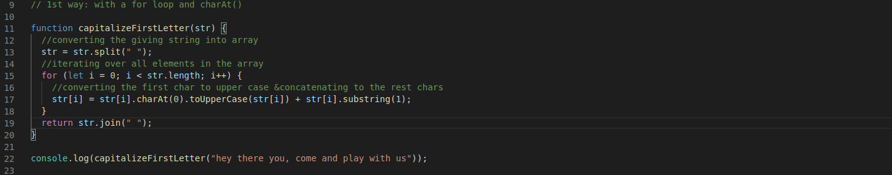

# 1st solution on the "capitalizeFirstLetter" exercise

Created a function named "capitalizeFirstLetter" in which I used firtsly .split(" ") method to convert the string into an array and then used a for loop to iterate over all the elemnets inside the array. Inside the loop I converted the first character of each indivuual index of the array and concatenated the rest of each indexes back to their fist character.
